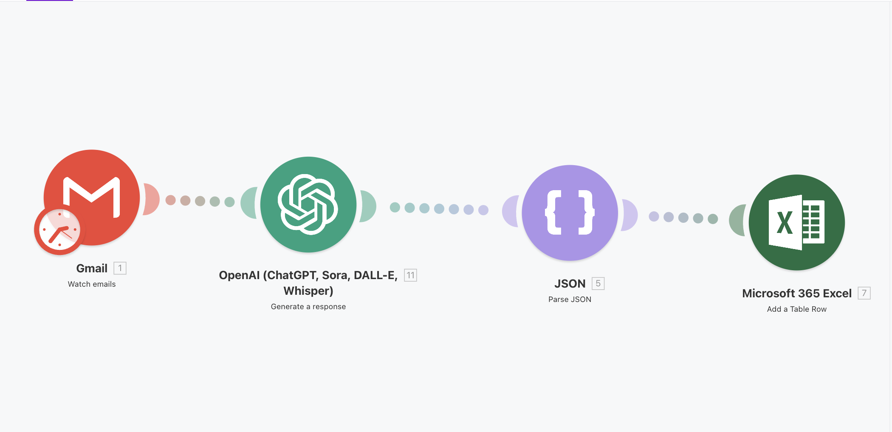
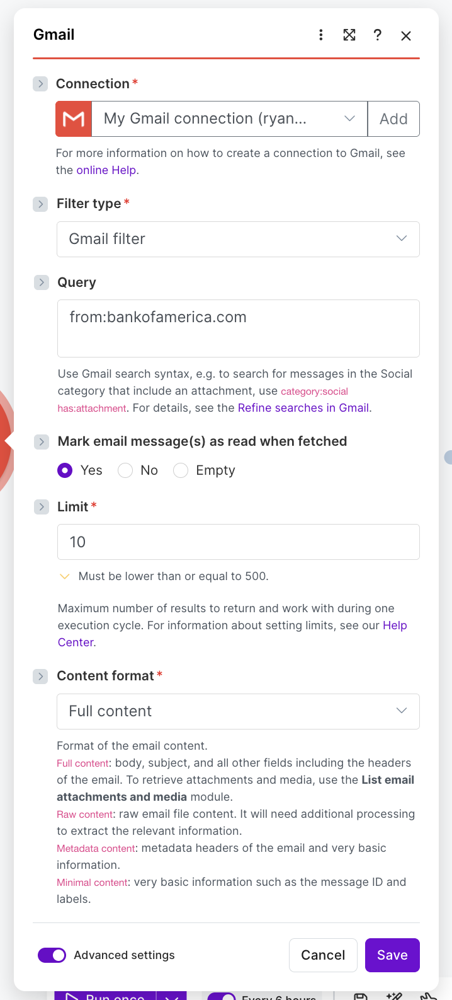
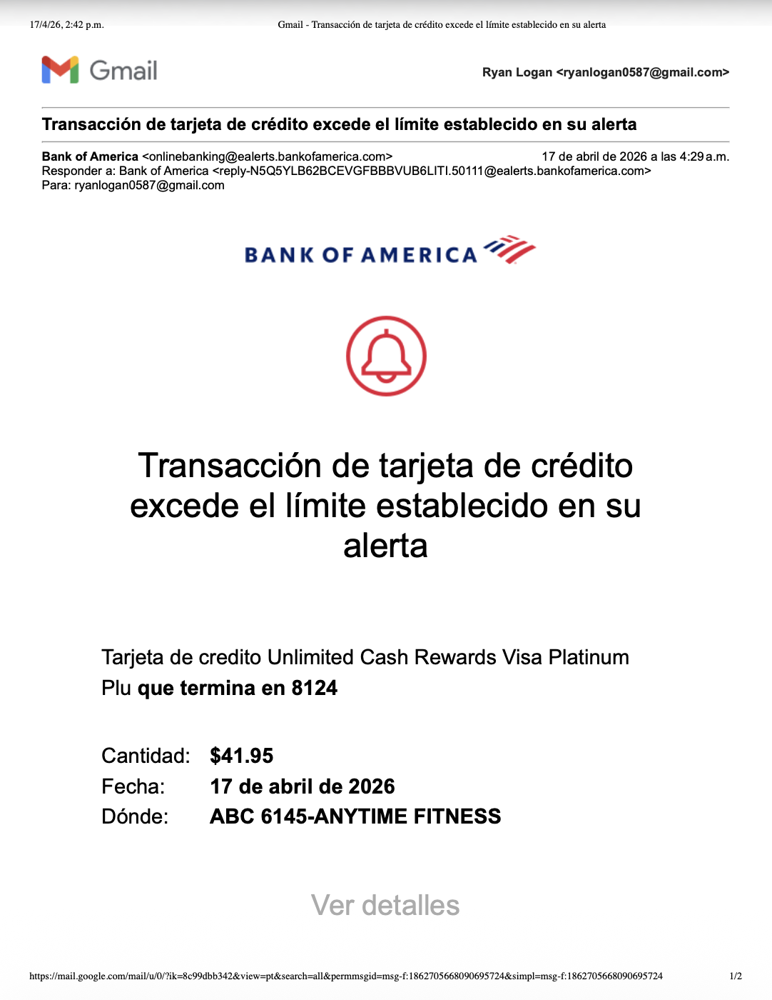
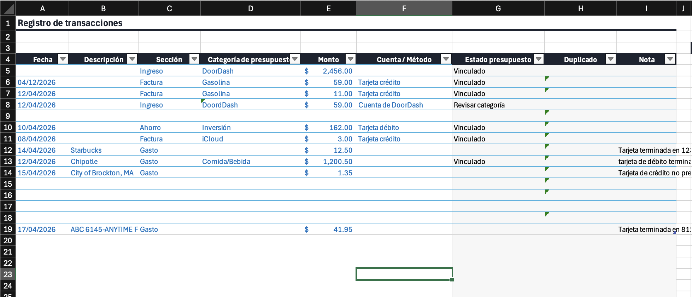

# AI Budget Automation (Make + AI)

This project is an automated system that processes Bank of America transaction emails and organizes them into a structured budgeting workflow.

It uses Make to handle automation and AI to extract and categorize financial data, reducing the need for manual tracking.

---

## Overview

The system takes unstructured email alerts and converts them into structured, categorized transactions that can be used in a budgeting system.

---

## Workflow

```
Bank of America Email → Make → AI Processing → Categorized Transaction → Budget Sheet
```

---

## System Components

* **Gmail** – Detects incoming transaction emails
* **Make** – Handles automation and workflow execution
* **AI (OpenAI)** – Extracts and categorizes transaction data
* **Budget Sheet** – Stores structured financial data

---

## Screenshots

### Make Scenario



### Gmail Filter



### Example Email



### Output (Budget Sheet)



---

## Features

* Automatically detects transaction emails
* Extracts merchant, amount, and date
* Classifies transactions into budget categories
* Reduces manual data entry
* Integrates with an existing budgeting system

---

## Example

**Input (Email):**

```
You spent $23.75 at Chipotle on April 14.
```

**Output:**

```
Merchant: Chipotle  
Amount: $23.75  
Date: 2024-04-14  
Section: Gasto  
Category: Comida/Bebida  
```

---

## Purpose

This project demonstrates how automation and AI can be combined to streamline financial workflows and reduce repetitive tasks in personal budgeting.

---

## Future Improvements

* Real-time integration with budget sheet
* Improved categorization accuracy
* Expanded support for different transaction formats
* Deeper analytics and spending insights
